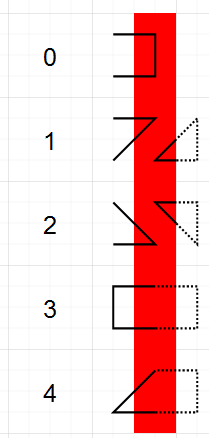
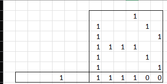

# [`TIOJ`]

[`back`](../)

## [`TIOJ 1001`] Hello World!
[`TIOJ 1001`]: https://tioj.ck.tp.edu.tw/problems/1001
### `C++`
```c++
#include<bits/stdc++.h>
int main(){std::cout<<"Hello Tmt World XD!\n";return 0;}
```
### `Tag`
```txt
基本輸出輸入
```

## [`TIOJ 1025`] 數獨問題
[`TIOJ 1025`]: https://tioj.ck.tp.edu.tw/problems/1025
### `C++`
```c++
#include<bits/stdc++.h>
using namespace std;
#define INT long long int
#define endl "\n"
#define read(n) reader<n>()
#define DBG if(debug)
#define PII pair<INT,INT>
bool debug=0;
bool noTLE=1;
template<typename tpe>tpe reader(){
	tpe re;cin>>re;return re;
}
INT mp[9][9];
bool row[9][10],column[9][10],box[3][3][10];
INT ans=0;
void solve(INT x=0,INT y=0){
	if(x==0 && y==0){
		memset(row,0,sizeof(row));
		memset(column,0,sizeof(column));
		memset(box,0,sizeof(box));
		debug=1;
		for(INT i=0;i<9;i++){
			for(INT j=0;j<9;j++){
				cin>>mp[i][j];
				row[i][mp[i][j]]=1;
				column[j][mp[i][j]]=1;
				box[i/3][j/3][mp[i][j]]=1;
			}
		}
	}
	if(y==9){solve(x+1,0);}
	else if(x==9){
		for(INT i=0;i<9;i++){
			for(INT j=0;j<9;j++){
				if(j)cout<<" ";
				cout<<mp[i][j];
			}
			cout<<endl;
		}
		cout<<endl;
		ans++;
	}
	else if(mp[x][y])solve(x,y+1);
	else{
		for(INT i=1;i<=9;i++){
			if(row[x][i] || column[y][i] || box[x/3][y/3][i])continue;
			row[x][i] = column[y][i] = box[x/3][y/3][i] = 1;
			mp[x][y]=i;
			solve(x,y+1);
			row[x][mp[x][y]] = column[y][mp[x][y]] = box[x/3][y/3][mp[x][y]] = 0;
			mp[x][y]=0;
		}
		mp[x][y]=0;
	}

	if(x==0 && y==0){
		cout<<"there are a total of "<<ans<<" solution(s)."<<endl;
	}
}
int main(int argc,char** argv){
	if(noTLE && !debug)cin.tie(0);cout.tie(0);ios::sync_with_stdio(0);
	solve();
	return 0;
}
```

## [`TIOJ 1080`] 逆序數對
[`TIOJ 1080`]: https://tioj.ck.tp.edu.tw/problems/1080
### [`C++`](https://gist.github.com/KagariET01/7f0c5973aa9491a0c269420418cc8311)
```c++
#include<bits/stdc++.h>
using namespace std;
#define INT long long int
#define PII pair<INT,INT>
#define maxs(a,b) a=max(a,b)
#define mins(a,b) a=min(a,b)

const INT mxn=1e5+5;
INT lst[mxn];
INT n;

INT merge_sort(INT *l,INT *r){
	if(r-l<=1)return 0;
	INT re=0;
	INT *mid=(r-l)/2+l;
	re+=merge_sort(l,mid);
	re+=merge_sort(mid,r);
	INT *i=l,*j=mid;
	vector<INT> newlst;
	newlst.reserve(r-l);
	while(i<mid && j<r){
		if(*i>*j){
			re+=(r-j);
			newlst.push_back(*i);
			i++;
		}else{
			newlst.push_back(*j);
			j++;
		}
	}
	while(i<mid){
		newlst.push_back(*i);
		i++;
	}
	while(j<r){
		newlst.push_back(*j);
		j++;
	}
	for(INT i:newlst){
		*l=i;
		l++;
	}
	return re;
}

int main(){
	ios::sync_with_stdio(0),cin.tie(0),cout.tie(0);
	INT t=1;
	while(cin>>n){
		if(!n)break;
		for(INT i=0;i<n;i++){
			cin>>lst[i];
		}
		cout<<"Case #"<<t<<": "<<merge_sort(lst,lst+n)<<endl;
		t++;
	}
	return 0;
}
```
### `Tag`
```txt
sort
	merge_sort
分治
```

## [`TIOJ 1320`] 雙子大廈 Twintower
[`TIOJ 1320`]: https://tioj.ck.tp.edu.tw/problems/1320
### `C++`
```c++
#include<bits/stdc++.h>
using namespace std;
#pragma GCC optimize("Ofast")
#pragma GCC optimize("O1")
#pragma GCC optimize("O2")
#pragma GCC optimize("O3")
#define INT long long int
#define endl "\n"

const INT mxn=500000;

int main(){
	cin.tie(0);cout.tie(0);ios::sync_with_stdio(0);
	struct dta{
		INT h;
		INT i;//實際位置
		INT mini;//左界
	};
	INT n;
	cin>>n;
	INT h[n+1];
	for(INT i=0;i<n;i++){
		cin>>h[i];
	}
	h[n]=1e9+7;
	INT mp[n+1];//mp[距離]=高
	for(INT i=0;i<=n;i++){
		mp[i]=1e9+7;
	}
	stack<dta> st;
	for(INT i=0;i<=n;i++){
		while(!st.empty()){
			dta &nw=st.top();
			if(nw.h<h[i]){
				INT hh=i-nw.mini;//最大距離
				mp[hh]=min(mp[hh],nw.h);
				st.pop();
			}else if(nw.h==h[i]){
				nw.i=i;
				break;
			}else break;
		}
		if(st.empty()){
			st.push({h[i],i,0});
		}else if(st.top().h==h[i])continue;
		else{
			st.push({h[i],i,st.top().i+1});
		}
	}
	INT nw=mp[n];
	for(INT i=n-1;i>=0;i--){
		nw=nw<mp[i]?nw:mp[i];
		mp[i]=nw;
	}
	INT q;
	cin>>q;
	INT inin;
	while(q--){
		cin>>inin;
		cout<<mp[inin]<<endl;
	}
	return 0;
}
```

## [`TIOJ 1828`] 控控控之蘿莉控
[`TIOJ 1828`]: https://tioj.ck.tp.edu.tw/problems/1828
### `C++`
```c++
#include<bits/stdc++.h>
using namespace std;
#define INT long long int
#define endl "\n"
#define read(n) reader<n>()
#define DBG if(debug)
#define PII pair<INT,INT>
bool debug=0;
bool noTLE=1;
template<typename tpe>tpe reader(){
	tpe re;cin>>re;return re;
}

int main(int argc,char** argv){
	if(noTLE && !debug)cin.tie(0);cout.tie(0);ios::sync_with_stdio(0);

	function<int(INT)> solve=[](INT casenum){
		INT a,b,c;
		cin>>a>>b>>c;
		if(a==0 && b==0){//在警局門口+警察剛出來抓你
			cout<<-1<<endl;
			return 0;
		}
		else if(a>10000){//不在警局範圍內
			cout<<0<<endl;
			return 0;
		}else if(c==0){//警察不會動
			if(a==0){//如果在警局門口
				cout<<1<<endl;
				return 0;
			}else{//如果不是
				cout<<0<<endl;
				return 0;
			}
		}else cout<<((10000*c-a*c)/(b*c+10000)+1)<<endl;//算警察到10000的時間和你要跑的距離，計算最小速率
		return 0;
	};
	bool one_case=0;
	bool ynans=0;
	bool eof=0;
	string yes="YES";
	string no="NO";
	INT t=(one_case?1:read(int));
	for(INT i=0;eof || i<t;i++){
		INT re=solve(i);
		if(!ynans){
			if(re==-1)return 0;
		}else{
			if(re==1){
				cout<<yes<<endl;
			}else if(re==0){
				cout<<no<<endl;
			}else{
				return 0;
			}
		}
	}
	return 0;
}
```

## [`TIOJ 2054`] 最大矩形涵蓋（cover）
[`TIOJ 2054`]: https://tioj.ck.tp.edu.tw/problems/2054
### `Thinking`
```txt
農兩個雙指標
第一個雙指標在最一開始就建立
該雙指標代表選取框的x座標

框好之後建第二個雙指標
異曲同工，這次是代表y座標的
```
### `c++`
```c++
#include<bits/stdc++.h>
/*using namespace*/
using namespace std;
/*define type*/
#define ULLI unsigned long long int
#define LLI long long int
#define INT LLI
#define PII pair<INT,INT>
#define DBG if(debug)
#define elif else if
#define read(n) reader<n>()
bool debug=0;
bool iofast=true;
/*fn定義*/
template<typename TPE>TPE reader(){
	TPE a;
	cin>>a;
	return a;
}

bool vser(PII a,PII b){
	return a.first<b.first;
}
/*main*/
int main(){
	if(!debug&&iofast){cin.tie(0);cout.tie(0);ios::sync_with_stdio(0);}
	INT t=1;
	while(t--){
		/*CIN*/
		INT n=read(INT);
		INT l,w;
		cin>>l>>w;
		vec.resize(n);
		for(INT i=0;i<n;i++){
			vec[i]={read(INT),read(INT)};
		}
		/*solve*/
		INT ans=0;
		sort(vec.begin(),vec.end(),vser);
		INT lx=0;
		for(INT rx=0;rx<n;rx++){
			while(vec[rx].FIR-vec[lx].FIR>w){
				lx++;
			}
			vector<INT> yvec;
			yvec.clear();
			for(INT i=lx;i<=rx;i++){
				yvec.push_back(vec[i].SEC);
			}
			sort(yvec.begin(),yvec.end());
			INT ly=0;
			for(INT ry=0;ry<yvec.size();ry++){
				while(yvec[ry]-yvec[ly]>l){
					ly++;
				}
				ans=max(ans,ry-ly+1);
			}
		}
		cout<<ans<<endl;
	}
	return 0;
}
```
### `tag`
```txt
雙指標
```

## [`TIOJ 2172`] 物種演化 (Evolution)
[`TIOJ 2172`]: https://tioj.ck.tp.edu.tw/problems/2172
### `C++`
```c++
#include<bits/stdc++.h>

using namespace std;
#define INT long long int
#define endl "\n"
#define read(n) reader<n>()
#define DBG if(debug)
#define PII pair<INT,INT>
bool debug=0;
bool noTLE=1;
template<typename tpe>tpe reader(){
	tpe re;cin>>re;return re;
}

const INT mxn=1e5;
INT lca[mxn+1][30];
INT n;
vector<INT> tre[mxn];
INT deep[mxn];

int main(int argc,char** argv){
	if(noTLE && !debug)cin.tie(0);cout.tie(0);ios::sync_with_stdio(0);

	function<int(INT)> solve=[](INT casenum){
		INT n,m;
		cin>>n>>m;
		for(INT i=1;i<n;i++){
			INT a,b;
			cin>>a>>b;
			tre[a].push_back(b);
			tre[b].push_back(a);
		}
		function<void(INT,INT)> dfs=[&](INT nw=0,INT lst=-1){
			lca[nw][0]=nw;
			lca[nw][1]=(lst==-1?nw:lst);
			for(INT i:tre[nw]){
				if(i==lst)continue;
				deep[i]=deep[nw]+1;
				dfs(i,nw);
			}
		};
		dfs(0,-1);
		for(INT j=2;j<30;j++){
			for(INT i=0;i<n;i++){
				lca[i][j]=lca[lca[i][j-1]][j-1];
			}
		}
		DBG{
			for(INT i=0;i<n;i++){
				cout<<"deep:"<<deep[i]<<" lca:";
				for(INT j=0;j<30;j++){
					cout<<lca[i][j]<<" ";
					if(!lca[i][j])break;
				}
				cout<<endl;
			}
		}
		while(m--){
			INT a,b;
			cin>>a>>b;
			if(a==0){
				cout<<deep[b]<<endl;
				continue;
			}else if(b==0){
				cout<<deep[a]<<endl;
				continue;
			}
			INT ans=0;
			if(deep[a]<deep[b])swap(a,b);
			if(deep[a]>deep[b]){
				INT deepx=deep[a]-deep[b];
				ans+=deepx;
				DBG cerr<<"deepx="<<deepx<<endl;
				for(INT i=1;deepx;i++){
					if(deepx&(1<<(i-1))){
						a=lca[a][i];
						deepx-=(1<<(i-1));
					}
				}
			}
			if(a==b){
				cout<<ans<<endl;
				continue;
			}
			DBG cout<<a<<" vs "<<b<<endl;
			for(INT i=29;i>=1;i--){
				if(deep[a]*2<(1<<(i-1)))continue;
				if(lca[a][i]!=lca[b][i]){
					ans+=(1<<(i-1))*2;
					a=lca[a][i];
					b=lca[b][i];
				}
			}
			cout<<ans+2<<endl;
		}
		return 0;
	};
	bool one_case=1;
	bool ynans=0;
	bool eof=0;
	string yes="YES";
	string no="NO";
	INT t=(one_case?1:read(int));
	for(INT i=0;eof || i<t;i++){
		INT re=solve(i);
		if(!ynans){
			if(re==-1)return 0;
		}else{
			if(re==1){
				cout<<yes<<endl;
			}else if(re==0){
				cout<<no<<endl;
			}else{
				return 0;
			}
		}
	}
	return 0;
}
```

## [`TIOJ 2246`] 迷宮入口<br>`TOI 2022_1 PA` 迷宮入口
[`TIOJ 2246`]: https://tioj.ck.tp.edu.tw/problems/2246
### `C++`
```c++
#include<bits/stdc++.h>
using namespace std;
#define INT long long int
#define endl "\n"
#define read(n) reader<n>()
#define DBG if(debug)
#define PII pair<INT,INT>
bool debug=0;
bool noTLE=1;
template<typename tpe>tpe reader(){
	tpe re;cin>>re;return re;
}

int main(int argc,char** argv){
	if(noTLE && !debug)cin.tie(0);cout.tie(0);ios::sync_with_stdio(0);

	function<int(INT)> solve=[](INT casenum){
		INT n,r;
		cin>>n>>r;
		vector<PII> ad;
		map<PII,INT> mp;
		ad.reserve(n);
		for(INT i=0;i<n;i++){
			ad.push_back({read(INT),read(INT)});
		}
		for(PII p:ad){
			INT x=p.first;
			INT y=p.second;
			for(INT mx=-r;mx<=r;mx++){
				for(INT my=-r;my<=r;my++){
					if(mx*mx+my*my>r*r)continue;
					mp[{x+mx,y+my}]++;
				}
			}
		}
		INT ans=0;
		for(pair<PII,INT> i:mp){
			ans+=(i.second&1);
		}
		cout<<ans<<endl;
		return 0;
	};
	bool one_case=1;
	bool ynans=0;
	bool eof=0;
	string yes="YES";
	string no="NO";
	INT t=(one_case?1:read(int));
	for(INT i=0;eof || i<t;i++){
		INT re=solve(i);
		if(!ynans){
			if(re==-1)return 0;
		}else{
			if(re==1){
				cout<<yes<<endl;
			}else if(re==0){
				cout<<no<<endl;
			}else{
				return 0;
			}
		}
	}
	return 0;
}
```
### `Tag`
```txt
TOI 臺灣國際資訊奧林匹亞競賽
```

## [`TIOJ 2247`] 打鍵盤<br>`TOI 2022_1 PB` 打鍵盤
[`TIOJ 2247`]: https://tioj.ck.tp.edu.tw/problems/2247
### `C++`
```c++
#include<bits/stdc++.h>
using namespace std;
#define INT long long int
#define endl "\n"
#define read(n) reader<n>()
#define DBG if(debug)
#define PII pair<INT,INT>
#define X first
#define Y second
#define mins(a,b) a=min(a,b)
bool debug=0;
bool noTLE=1;
template<typename tpe>tpe reader(){
	tpe re;cin>>re;return re;
}

PII operator+(PII a,PII b){
	return {a.first+b.first,a.second+b.second};
}
char keyboard[3][10]={
	{'Q','W','E','R','T','Y','U','I','O','P'},
	{'A','S','D','F','G','H','J','K','L',' '},
	{'Z','X','C','V','B','N','M',' ',' ',' '}
};
PII mv[6]={
	{-1,0},
	{-1,1},
	{0,-1},
	{0,1},
	{1,-1},
	{1,0},
};
map<pair<char,char>,INT> mp;
void bfs(PII ad){
	if(keyboard[ad.X][ad.Y]==' ')return;
	queue<PII> que;
	que.push(ad);
	while(!que.empty()){
		PII nw=que.front();
		que.pop();
		for(INT i=0;i<6;i++){
			PII nx=nw+mv[i];
			if(nx==ad)continue;
			if(mp[{keyboard[ad.X][ad.Y],keyboard[nx.X][nx.Y]}])continue;
			if(keyboard[nx.X][nx.Y]==' ')continue;
			if(0<=nx.X && nx.X<3 &&
			0<=nx.Y && nx.Y<10){
				mp[{keyboard[ad.X][ad.Y],keyboard[nx.X][nx.Y]}]=
				mp[{keyboard[ad.X][ad.Y],keyboard[nw.X][nw.Y]}]+1;
				que.push(nx);
			}
		}
	}
}

int main(int argc,char** argv){
	if(noTLE && !debug)cin.tie(0);cout.tie(0);ios::sync_with_stdio(0);

	function<int(INT)> solve=[](INT casenum){
		INT n;
		cin>>n;
		string str=read(string);
		INT dp[n+5][30][30];
		for(INT i=0;i<n+5;i++){
			for(INT j=0;j<30;j++){
				for(INT k=0;k<30;k++){
					dp[i][j][k]=1e9+7;
				}
			}
		}
		INT ans=1e9;
		dp[0]['F'-'A']['J'-'A']=0;
		for(INT i=0;i<n;i++){
			for(INT j=0;j<26;j++){
				for(INT k=0;k<26;k++){
					if(dp[i][j][k]>=1e9)continue;
					mins(dp[i+1][j][str[i]-'A'],dp[i][j][k]+mp[make_pair(str[i],char('A'+k))]);
					mins(dp[i+1][str[i]-'A'][k],dp[i][j][k]+mp[make_pair(str[i],char('A'+j))]);
					if(i==n-1){
						mins(ans,dp[i+1][j][str[i]-'A']);
						mins(ans,dp[i+1][str[i]-'A'][k]);
					}
				}
			}
		}
		cout<<ans<<endl;
		
		//cout<<mp[{read(char),read(char)}]<<endl;
		return 0;
	};
	INT x=0,y=0;
	for(x=0;x<3;x++){
		for(y=0;y<10;y++){
			bfs(make_pair(x,y));
		}
	}
	for(char c='A';c<='Z';c++){
		mp[{c,c}]=0;
	}
	bool one_case=1;
	bool ynans=0;
	bool eof=0;
	string yes="YES";
	string no="NO";
	INT t=(one_case?1:read(int));
	for(INT i=0;eof || i<t;i++){
		INT re=solve(i);
		if(!ynans){
			if(re==-1)return 0;
		}else{
			if(re==1){
				cout<<yes<<endl;
			}else if(re==0){
				cout<<no<<endl;
			}else{
				return 0;
			}
		}
	}
	return 0;
}
```
### `Tag`
```txt
TOI 臺灣國際資訊奧林匹亞競賽
```

## [`TIOJ 2248`] 共享自行車<br>`TOI 2022_1 PC` 共享自行車
[`TIOJ 2248`]: https://tioj.ck.tp.edu.tw/problems/2248
### `C++`
```c++
#include<bits/stdc++.h>
using namespace std;
#define INT long long int
#define endl "\n"
#define read(n) reader<n>()
#define DBG if(debug)
#define PII pair<INT,INT>
#define X first
#define Y second
#define mins(a,b) a=min(a,b)
bool debug=0;
bool noTLE=1;
template<typename tpe>tpe reader(){
	tpe re;cin>>re;return re;
}

const INT mxn=1e5;
INT n,k;
INT w[mxn+1];
vector<PII> vec[mxn+1];//{node,len}
INT ans=0;

int main(int argc,char** argv){
	if(noTLE && !debug)cin.tie(0);cout.tie(0);ios::sync_with_stdio(0);

	function<int(INT)> solve=[&](INT casenum){
		cin>>n>>k;
		for(INT i=0;i<n;i++){
			cin>>w[i];
		}
		for(INT i=1;i<n;i++){
			INT a,b,c;
			cin>>a>>b>>c;
			a--,b--;
			vec[a].push_back({b,c});
			vec[b].push_back({a,c});
		}

		function<INT(INT,INT)> dfs=[&](INT nw,INT pre){
			for(PII i:vec[nw]){
				if(i.first==pre)continue;
				INT nxt=dfs(i.first,nw);
				ans+=abs(nxt)*i.second;
				w[nw]+=nxt;
			}
			return w[nw]-k;
		};
		dfs(0,-1);
		cout<<ans<<endl;
		return 0;
	};
	bool one_case=1;
	bool ynans=0;
	bool eof=0;
	string yes="YES";
	string no="NO";
	INT t=(one_case?1:read(int));
	for(INT i=0;eof || i<t;i++){
		INT re=solve(i);
		if(!ynans){
			if(re==-1)return 0;
		}else{
			if(re==1){
				cout<<yes<<endl;
			}else if(re==0){
				cout<<no<<endl;
			}else{
				return 0;
			}
		}
	}
	return 0;
}
```
### `Tag`
```txt
TOI 臺灣國際資訊奧林匹亞競賽
```

## [`TIOJ 2254`] 汽車不再繞圈圈
### `Thinking`
> 使用二分搜，尋找最小需要的power
> 因為有power的路可以任意更改方向，dfs時可忽略這些邊
> 使用dfs 以O(n+m)的方式判斷是否有環
> 找到最小power後，在更據深度判斷哪些邊需要反轉
> 時間複雜度 $log((n+m)log_2(c_i))$
### `C++`
```c++
#include<bits/stdc++.h>

using namespace std;
#define INT long long int
#define endl "\n"
#define read(n) reader<n>()
#define DBG if(debug)
#define PII pair<INT,INT>
//#define max(a,b) ((a>b)?a:b)
//#define min(a,b) ((a<b)?a:b)
#define maxs(a,b) a=max(a,b)
#define mins(a,b) a=min(a,b)
template<typename tpe>tpe reader(){tpe re;cin>>re;return re;}

bool debug=0;
bool noTLE=1;

bool one_case=1;
bool ynans=0;
bool eof=0;
string yes="YES";
string no="NO";


const INT mxn=1e5+5;
INT n,m;
struct edge{
	INT t,w,id;
};
vector<edge> tree[mxn];
INT indo[mxn]={};
bool vis[mxn]={};
bool ins[mxn]={};
vector<INT> s;//深度，最深的在最前面
bool dfs(INT nw,INT lim){
	vis[nw]=1;
	ins[nw]=1;
	for(edge i:tree[nw]){
		if(i.w>lim){
			if(!vis[i.t]){
				if(!dfs(i.t,lim)){
					return 0;
				}
			}else if(ins[i.t]){
				return 0;
			}
		}
	}
	ins[nw]=0;
	s.push_back(nw);
	return 1;
};
function<bool(INT)> checker=[](INT lim){
	s.clear();
	memset(vis,0,sizeof(vis));
	memset(ins,0,sizeof(ins));
	for(INT i=1;i<=n;i++){
		if(!vis[i]){//沒拜訪過
			if(!dfs(i,lim)){
				return 0;
			}
		}
	}
	return 1;
};
function<int(INT)> solve=[](INT casenum){
	cin>>n>>m;
	for(INT i=1;i<=n;i++){
		tree[i].clear();
		vis[i]=0;
		ins[i]=0;
	}
	for(INT i=1;i<=m;i++){
		INT a,b,c;
		a--,b--;
		cin>>a>>b>>c;
		tree[a].push_back({b,c,i});
	}
	INT l=0,r=1e9+5;
	while(l<r){
		INT mid=(r-l)/2+l;
		if(checker(mid)){
			r=mid;
		}else{
			l=mid+1;
		}
	}
	INT P=l;
	checker(P);
	vector<INT> deep(n+5);
	s.clear();
	for(INT i=0;i<n;i++){
		deep[s[i]]=i;
	}
	for(INT i=1;i<=n;i++){
		for(edge j:tree[i]){
			if(deep[i]<deep[j.t]){
				s.push_back(j.id);
			}
		}
	}
	cout<<P<<' '<<s.size()<<endl;
	for(INT i:s){
		cout<<i<<endl;
	}
	return 0;
};


int main(int argc,char** argv){
	if(noTLE && !debug){cin.tie(0);cout.tie(0);ios::sync_with_stdio(0);}
	INT t=(one_case?1:read(int));
	for(INT i=0;eof || i<t;i++){
		INT re=solve(i);
		if(!ynans){
			if(re==-1)return 0;
		}else{
			if(re==1){
				cout<<yes<<endl;
			}else if(re==0){
				cout<<no<<endl;
			}else{
				return 0;
			}
		}
	}
	return 0;
}
```

## [`TIOJ 2255`] 天空競技場
[`TIOJ 2255`]: https://tioj.ck.tp.edu.tw/problems/2255
### `Score`
```diff
- 1. 000/000 範例測資
- 2. 000/009 n<=1000
+ 3. 019/019 x=y=0
- 4. 000/018 x=0
- 5. 000/054 無額外限制
```
### `C++`
```c++
#include<bits/stdc++.h>

using namespace std;
#define INT int
#define endl "\n"
#define read(n) reader<n>()
#define DBG if(debug)
#define PII pair<INT,INT>
#define maxs(a,b) a=max(a,b)
#define mins(a,b) a=min(a,b)
bool debug=0;
bool noTLE=1;
template<typename tpe>tpe reader(){tpe re;cin>>re;return re;}

struct str{
	INT x,y,t,w;
};

const INT mxn=3e5;
INT n,m;
str f[mxn];

int main(int argc,char** argv){
	for(int i=0;i<argc;i++){
		string nwstr=argv[i];
		if(nwstr=="-Dev"){
			debug=1;
			noTLE=0;
		}else if(nwstr=="-TLE"){
			noTLE=0;
		}
	}
	DBG{
		cout<<"Temp by KagariET01"<<endl;
		cout<<"My Webpage: https://kagariet01.github.io/about"<<endl;
		cout<<"===DBG mod on==="<<endl;
		cout<<"Here's your CFG"<<endl;
		for(int i=0;i<argc;i++){
			string nwstr=argv[i];
			cout<<'['<<nwstr<<']'<<endl;
		}
		cout<<"===Code start==="<<endl;
	}
	if(noTLE && !debug){cin.tie(0);cout.tie(0);ios::sync_with_stdio(0);}

	function<int(INT)> solve=[](INT casenum){
		if(!(cin>>n>>m))return -1;
		for(INT i=0;i<n;i++){
			cin>>f[i].x>>f[i].y>>f[i].t>>f[i].w;
		}
		INT nwtt=0;
		INT ans=0;
		INT nw=0;
		INT l=0;
		for(INT r=0;r<n;r++){
			nwtt+=f[r].t;
			nw+=f[r].w;
			while(nwtt>m){
				nwtt-=f[l].t;
				nw-=f[l].w;
				l++;
			}
			maxs(ans,nw);
		}
		cout<<ans<<endl;
		return 0;
	};
	bool one_case=1;
	bool ynans=0;
	bool eof=1;
	string yes="YES";
	string no="NO";
	INT t=(one_case?1:read(int));
	for(INT i=0;eof || i<t;i++){
		INT re=solve(i);
		if(!ynans){
			if(re==-1)return 0;
		}else{
			if(re==1){
				cout<<yes<<endl;
			}else if(re==0){
				cout<<no<<endl;
			}else{
				return 0;
			}
		}
	}
	return 0;
}
```

## [`TIOJ 2258`] 天竺鼠遊行
[`TIOJ 2258`]: https://tioj.ck.tp.edu.tw/problems/2258
### `C++`
```c++
#include<bits/stdc++.h>

using namespace std;
#define INT int
#define endl "\n"
#define read(n) reader<n>()
#define DBG if(debug)
#define PII pair<INT,INT>
#define maxs(a,b) a=max(a,b)
#define mins(a,b) a=min(a,b)
bool debug=0;
bool noTLE=1;
template<typename tpe>tpe reader(){tpe re;cin>>re;return re;}

const INT mxn=1e6+5;
INT n,k,p;
INT h[mxn];

bool checker(INT lim){
	INT l=0,cnt=0,mx=h[0]-h[1];
	if(k>2){
		for(INT i=2;i<n;i++){
			if(i-2>=l){
				maxs(mx,h[i-2]-h[i]);
			}
			if(mx>lim){
				l=i-1;
				mx=h[i-1]-h[i];
			}
			if(i-l+1>=k){
				cnt++;
				l=i+1;
				mx=0;
			}
		}
	}else{
		for(INT i=1;i<n;i++){
			if(h[i-1]-h[i]<=lim){
				cnt++;
				i++;
			}
		}
	}
	return cnt>=p;
}

int main(int argc,char** argv){
	if(noTLE && !debug){cin.tie(0);cout.tie(0);ios::sync_with_stdio(0);}

	function<int(INT)> solve=[](INT casenum){
		if(!(cin>>n>>k>>p))return -1;
		for(INT i=0;i<n;i++){
			cin>>h[i];
		}
		sort(h,h+n,[](INT a,INT b){return a>b;});
		INT l=0,r=h[0]-h[n-1];
		while(l<r){
			INT mid=(r-l)/2+l;
			if(checker(mid))
				r=mid;
			else l=mid+1;
		}
		cout<<l<<endl;
		return 0;
	};
	bool one_case=1;
	bool ynans=0;
	bool eof=1;
	string yes="YES";
	string no="NO";
	INT t=(one_case?1:read(int));
	for(INT i=0;eof || i<t;i++){
		INT re=solve(i);
		if(!ynans){
			if(re==-1)return 0;
		}else{
			if(re==1){
				cout<<yes<<endl;
			}else if(re==0){
				cout<<no<<endl;
			}else{
				return 0;
			}
		}
	}
	return 0;
}
```
### `Tag`
```txt
NHSPC 全國資訊學科能力競賽
	2021 PH
二分搜
``` 

## [`TIOJ 2259`] 鐵路鋪設
[`TIOJ 2259`]: https://tioj.ck.tp.edu.tw/problems/2259
### `Thinking`
> 建立一個DP陣列  
> 每一欄儲存的資料如下圖所示  
>   
> 列出DP式，再用矩陣乘法+快速冪優化  
> 轉移表+初始設定如下（假設初始狀態為i=1）
>   
### `C++`
```c++
#include<bits/stdc++.h>
using namespace std;
#define what_the_fuck cin.tie(0);cout.tie(0);ios::sync_with_stdio(false)
#define ULLI unsigned long long int
#define LLI long long int
#define INT LLI
#define UINT unsigned INT
#define PII pair<INT,INT>
#define PUIUI pair<UINT,UINT>
#define endl "\n"
#define DBG if(debug)
#define FIR first
#define SEC second
#define elif else if
#define wassomething() empty()==false
struct mat;
bool debug=0;
bool iofast=true;
PII mv[]={{0,1},{1,0},{0,-1},{-1,0}};
INT mx[]={0,1,0,-1};
INT my[]={1,0,-1,0};
INT mod=1e9+7;
/*struct定義*/
struct mat{
	INT a[6][6];
	mat(){
		memset(a,0,sizeof(a));
	}
	mat operator*(const mat &b)const{
		mat re;
		for(INT i=0;i<6;i++){
			for(INT j=0;j<6;j++){
				for(INT k=0;k<6;k++){
					re.a[i][j]=(re.a[i][j]+a[i][k]*b.a[k][j])%mod;
				}
			}
		}
		return re;
	}
};
/*fn定義*/
PII padd(PII a,PII b){
	return {a.FIR+b.FIR,a.SEC+b.SEC};
}
/*main*/
int main(){
	if(!debug&&iofast){what_the_fuck;}
	/*CIN*/
	INT n;
	cin>>n;
	/*solve*/
	n--;
	mat bs;
	bs.a[0][3]=1;
	mat aa;

	aa.a[0][3]=1;

	aa.a[1][0]=1;
	aa.a[1][4]=1;
	
	aa.a[2][0]=1;
	aa.a[2][5]=1;
	
	aa.a[3][0]=1;
	aa.a[3][1]=1;
	aa.a[3][2]=1;
	aa.a[3][3]=1;

	aa.a[4][0]=1;
	aa.a[4][4]=1;
	
	aa.a[5][0]=1;
	aa.a[5][5]=1;
	while(n){
		if(n&1){
			bs=bs*aa;
		}
		aa=aa*aa;
		n>>=1;
	}
	cout<<bs.a[0][0]<<endl;
	return 0;
}
```


[`Codeforces`]: /OJ_ans/cf
[`TIOJ`]: /OJ_ans/ti
[`Zerojudge`]: /OJ_ans/zj
[`PCIC`]: /OJ_ans/PCIC

<link id="style_css" rel="stylesheet" type="text/css" href="/OJ_ans/style.css">
